# toScrapeBS4

Различные методы парсинга данных с сайта-песочницы [toscrape.com (Quotes)](https://toscrape.com/).
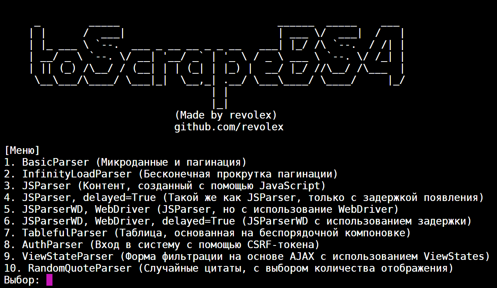

## Описание

Этот проект представляет собой хранилище различных способов парсинга данных с сайта toscrape.com. Он реализован на языке
Python с использованием таких библиотек, как:

- Asyncio
- Aiohttp
- BeautifulSoup4
- Selenium
- Различные зависимости

Полный список можно увидеть в [requirements.txt](requirements.txt)

Основная особенность проекта заключается в том, что все способы парсинга (кроме того, где используется библиотека
Selenium) реализованы асинхронно, что позволяет выполнять
работу быстрее и эффективнее.

## Таблица контента

- [Установка](#Установка)
- [Использование](#Использование)
- [Карта проекта](#Карта-проекта)
- [Типы парсеров](#Типы-парсеров)
-
    - [BasicParser](#BasicParser)
-
    - [InfinityLoadParser](#InfinityLoadParser)
-
    - [JSParser](#JSParser)
-
    - [JSParserWD](#JSParserWD)
-
    - [TablefulParser](#TablefulParser)
-
    - [AuthParser](#AuthParser)
-
    - [ViewStateParser](#ViewStateParser)
-
    - [RandomQuoteParser](#RandomQuoteParser)
- [Вклад](#Вклад)
- [Лицензия](#Лицензия)

## Установка

Проверена работоспособность на Windows 10 (22H2) вместе с Python 3.8

1. Клонируйте репозиторий на свой локальный компьютер:

   ```bash
   git clone https://github.com/revolexGeek/toScrapeBS4.git
   ```

2. Установите необходимые зависимости:

   ```bash
   pip install -r requirements.txt
   ```

3. Запустите проект:

   ```bash
   python main.py
   ```

## Использование

Проект сделан полностью по принципу ООП, что позволяет запустить каждый тип парсера отдельно.
Все примеры использования отдельных типов парсеров указаны в их модульных файлах.

Пример использования **BasicParser**:

```python
from Crawlers.BasicParser import BasicParser
import asyncio


async def main():
    # Создание экземпляра класса BasicParser
    parser = BasicParser()

    # Запуск сбора данных
    await parser.execute()


if __name__ == "__main__":
    # Получение цикла событий asyncio
    loop = asyncio.get_event_loop()

    # Запуск асинхронной функции main в цикле событий
    loop.run_until_complete(main())
```

Также, вы можете посмотреть на работу всех типов парсеров, путем запуска файла [main.py](main.py).

```bash
python main.py
```

## Карта проекта

Здесь представлена карта завершенности данного проекта.

- [X] BasicParser
- [X] InfinityLoadParser
- [X] JSParser
- [X] JSParserWD
- [X] TablefulParser
- [X] AuthParser
- [X] ViewStateParser
- [X] RandomQuoteParser

## Типы парсеров

Здесь будут рассмотрены все существующие в данном проекте типы парсеров, а также главные "подводные камни", с которыми
пришлось столкнуться.

### BasicParser

#### Краткое описание от toscrape.com

Микроданные и постраничная разбивка

#### Полное описание

Данный тип парсера предполагает сбор таких данных как:

- [X] Текст каждой из цитат
- [X] Имя автора каждой из цитат
- [X] Дату рождения автора каждой из цитат
- [X] Место рождения автора каждой из цитат
- [X] Описание автора каждой из цитат
- [X] Все теги каждой из цитат

Данный тип парсера является самым обычным, т.к. при его реализации не возникало никаких
"подводных камней".

Также, в данном типе парсера устроена система "кэширования" собранных авторов. То есть, если в цитате упомянается уже
собранный ранее автор, программа не будет собирать его по новой, а установит уже собранный экземпляр.

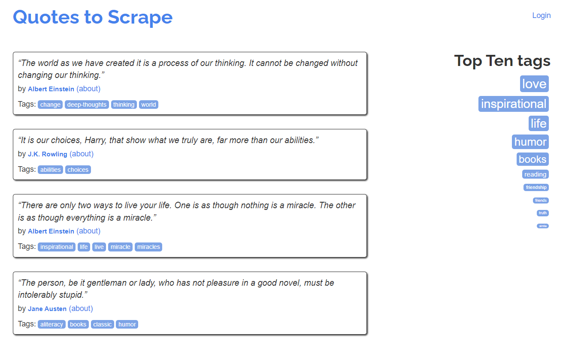


#### Пример работы


#### Пример выходного файла

Выходной файл можно посмотреть здесь: [BasicParserOutput.xlsx](Github/OutputFiles/BasicParserOutput.xlsx)

#### Реализация

Реализацию данного типа парсера вы можете найти в файле [BasicParser.py](Crawlers/BasicParser.py)

### InfinityLoadParser

#### Краткое описание от toscrape.com

Пагинация с бесконечной прокруткой

#### Полное описание

Данный тип парсера предполагает сбор таких данных как:

- [X] Текст каждой из цитат
- [X] Имя автора каждой из цитат
- [ ] Дату рождения автора каждой из цитат
- [ ] Место рождения автора каждой из цитат
- [ ] Описание автора каждой из цитат
- [X] Все теги каждой из цитат

_Собираются не все данные, т.к. данное ответвление на toscrape.com не предоставляет соответствующие данные, как например
в парсер, типа BasisParser._

В данном типе парсера используется сбор данных, которые проходят по `API` сайта при подгрузке страницы. (Пришлось
пройтись
Chrome дебагером, чтобы не делать под это `WebDriver`).

##### Пример запроса данных с API

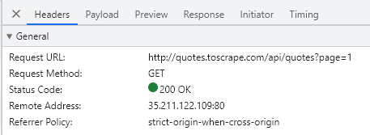

##### Пример ответа с API

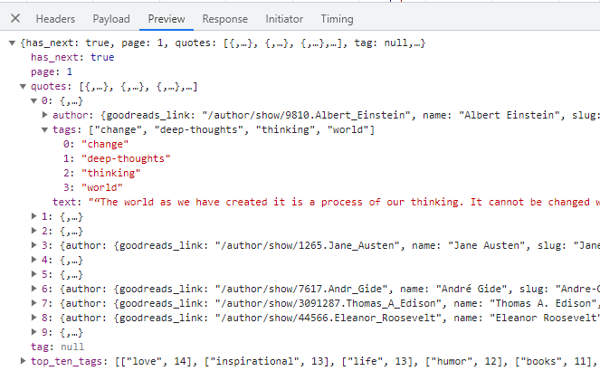

#### Пример работы

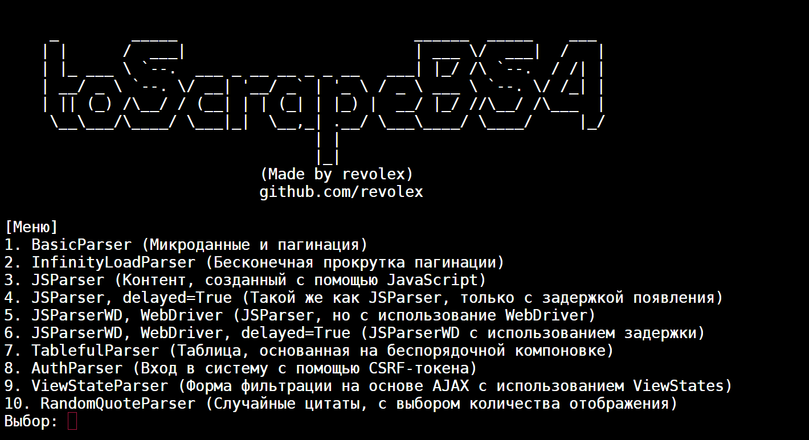

#### Пример выходного файла

Выходной файл можно посмотреть здесь: [OtherOutput.xlsx](Github/OutputFiles/OtherOutput.xlsx)

#### Реализация

Реализацию данного типа парсера вы можете найти в файле [InfinityLoadParser.py](Crawlers/InfinityLoadParser.py)

### JSParser

#### Краткое описание от toscrape.com

- Контент, сгенерированный на JavaScript;
- То же самое, что и JavaScript, но с задержкой рендера (delay=True).

#### Полное описание

Данный тип парсера предполагает сбор таких данных как:

- [X] Текст каждой из цитат
- [X] Имя автора каждой из цитат
- [ ] Дату рождения автора каждой из цитат
- [ ] Место рождения автора каждой из цитат
- [ ] Описание автора каждой из цитат
- [X] Все теги каждой из цитат

_Собираются не все данные, т.к. данное ответвление на toscrape.com не предоставляет соответствующие данные, как например
в парсер, типа BasisParser._

В данном типе парсера происходит утилизация `JavaScript` кода, который выполняется при загрузке страницы. Данные
берутся
методом нахождения правильного `<script>` тега и дальнейшего его форматирования в JSON-массив элементов.

##### Пример нужного тега

```javascript
<script>
    var data = [
    {
        "tags": [
        "change",
        "deep-thoughts",
        "thinking",
        "world"
        ],
        "author": {
        "name": "Albert Einstein",
        "goodreads_link": "/author/show/9810.Albert_Einstein",
        "slug": "Albert-Einstein"
    },
        "text": "\u201cThe world as we have created it is a process of our thinking. It cannot be changed without changing our thinking.\u201d"
    },
    ...
    {
        "tags": [
        "humor",
        "obvious",
        "simile"
        ],
        "author": {
        "name": "Steve Martin",
        "goodreads_link": "/author/show/7103.Steve_Martin",
        "slug": "Steve-Martin"
    },
        "text": "\u201cA day without sunshine is like, you know, night.\u201d"
    }
    ];
    for (var i in data) {
    var d = data[i];
    var tags = $.map(d['tags'], function(t) {
    return "<a class='tag'>" + t + "</a>";
}).join(" ");
    document.write("<div class='quote'><span class='text'>" + d['text'] + "</span><span>by <small class='author'>" + d['author']['name'] + "</small></span><div class='tags'>Tags: " + tags + "</div></div>");
}
</script>
```

#### Пример работы

Без параметра `Delay`


С параметром `Delay`


_Такая несущественная разница во времени между `Delay` и `NoDelay` обусловлена тем, что в обоих случаях происходит "
выдергивание" данных из самого заполняющего страницу скрипта, что в конечном итоге никак не влияет на задежрку появления
карточек в `DOM-дереве`._

#### Пример выходного файла

Выходной файл можно посмотреть здесь: [OtherOutput.xlsx](Github/OutputFiles/OtherOutput.xlsx)

#### Реализация

Реализацию данного типа парсера вы можете найти в файле [JSParser.py](Crawlers/JSParser.py)

### JSParserWD

#### Краткое описание от toscrape.com

- Контент, сгенерированный на JavaScript;
- То же самое, что и JavaScript, но с задержкой рендера (delay=True).

#### Полное описание

Данный тип парсера предполагает сбор таких данных как:

- [X] Текст каждой из цитат
- [X] Имя автора каждой из цитат
- [ ] Дату рождения автора каждой из цитат
- [ ] Место рождения автора каждой из цитат
- [ ] Описание автора каждой из цитат
- [X] Все теги каждой из цитат

_Собираются не все данные, т.к. данное ответвление на toscrape.com не предоставляет соответствующие данные, как например
в парсер, типа BasisParser._

В данном типе парсера происходит прогрузка **JavaScript** кода с помощью использования "настоящего" клиента (или же
WebDriver'а), зачастую в Headless (безглавом, без открытия браузера) режиме или же без него.

#### Пример работы

Без параметра **Delay**


_Немного непонятно почему в разных случаях скорость разница, однако с данным типом парсера можно получить скорость от 16
до 120 секунд._

В общем, **under investigation**.

С параметром **Delay**


_В данном случае, такую скорость работы можно объяснить. Каждая страница, при переходе по /js-delay эндпоинтам выдает
задержку в 10 секунд перед появленияем, можно сделать определенные выводы._

_На данной песочнице 10 страниц по 10 секунд задержки, следовательно, 10*10 = 100 секунд одной задержки добавления
карточек в DOM-дерево._

#### Пример выходного файла

Выходной файл можно посмотреть здесь: [OtherOutput.xlsx](Github/OutputFiles/OtherOutput.xlsx)

#### Реализация

Реализацию данного типа парсера вы можете найти в файле [JSParser.py](Crawlers/JSParser.py)

### TablefulParser

#### Краткое описание от toscrape.com

Таблица, основанная на беспорядочной компоновке

#### Полное описание

Данный тип парсера предполагает сбор таких данных как:

- [X] Текст каждой из цитат
- [X] Имя автора каждой из цитат
- [ ] Дату рождения автора каждой из цитат
- [ ] Место рождения автора каждой из цитат
- [ ] Описание автора каждой из цитат
- [X] Все теги каждой из цитат

_Собираются не все данные, т.к. данное ответвление на toscrape.com не предоставляет соответствующие данные, как например
в парсер, типа BasisParser._

В данном типе парсера происходит сбор данных внутри сбитой таблицы. Главной сложностью реализации является проведение
корректной структуризации таблицы.

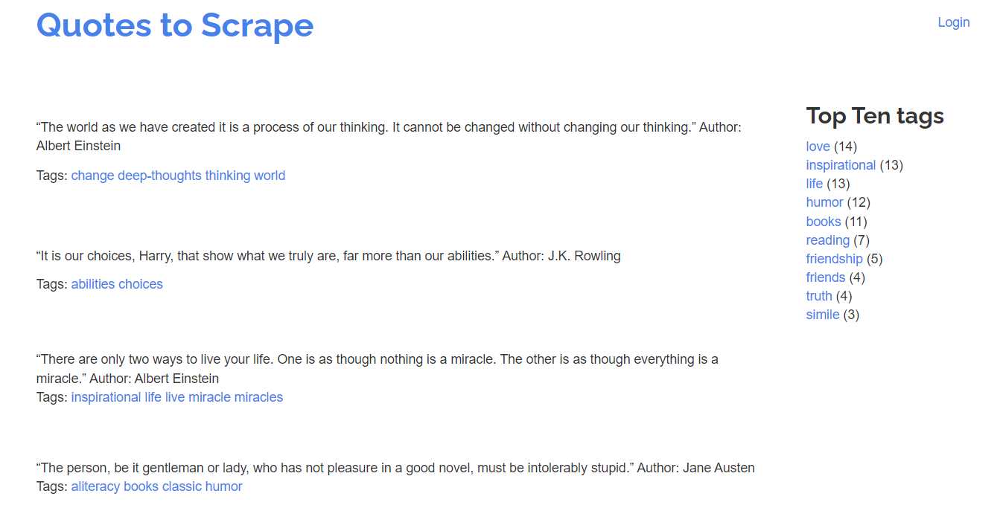

#### Вид DOM-дерева страницы

1. Первая строка таблицы (Топ цитат, справа)

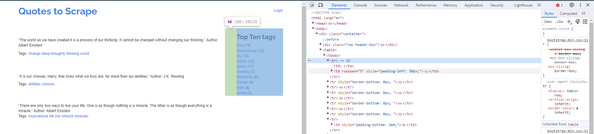

2. Вторая строка таблицы и до -1 строки таблицы (Текст + автор, тэги)

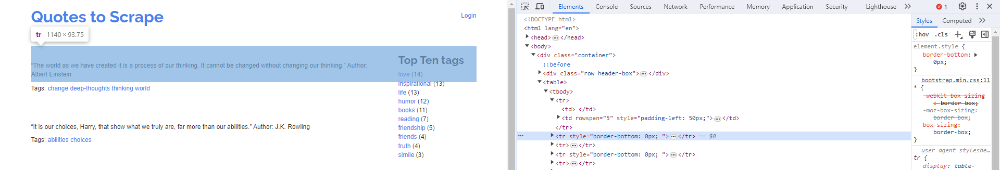
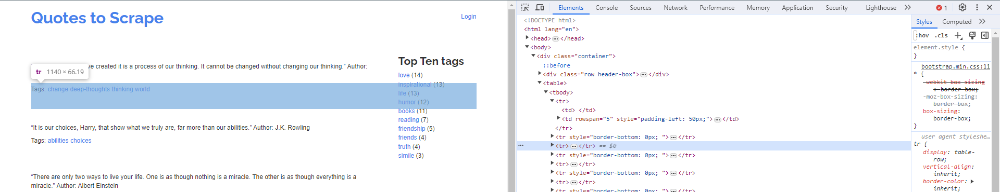

_Как можно увидеть, каждые две строки таблицы, начиная со второй, у нас занимают сами цитаты, которые неприятно
разделены._

_Тем самым, мы можем брать все внутренние элементы (разделенные цитаты) срезом [1:-1] и проверять их на
четность/нечетность, тем самым отбирая необходимые нам данные._

3. Последняя строка таблицы (пагинация)

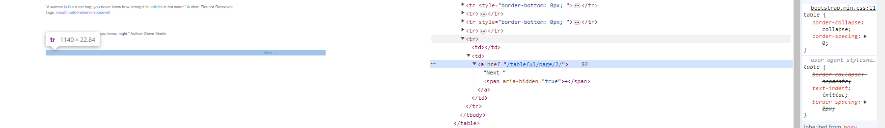

#### Пример работы

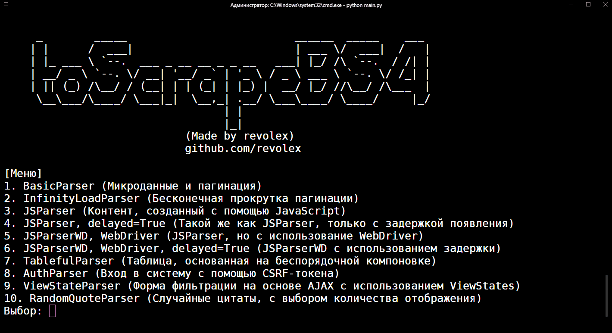

#### Пример выходного файла

Выходной файл можно посмотреть здесь: [OtherOutput.xlsx](Github/OutputFiles/OtherOutput.xlsx)

#### Реализация

Реализацию данного типа парсера вы можете найти в файле [TablefulParser.py](Crawlers/TablefulParser.py)

### AuthParser

#### Краткое описание от toscrape.com

Вход в систему с помощью CSRF-токена

#### Полное описание

Данный тип парсера предполагает сбор таких данных как:

- [X] Текст каждой из цитат
- [X] Имя автора каждой из цитат
- [X] Дату рождения автора каждой из цитат
- [X] Место рождения автора каждой из цитат
- [X] Описание автора каждой из цитат
- [X] Все теги каждой из цитат

В данном типе парсера перед выполнением всех запросов выполняется аутентификация сессии, на основе которой в дальнейшем
и будут идти все запросы.

#### Работа эндпоинта /login

В DOM-дереве данной страницы мы можем увидеть тэг `form`, в котором всегда хранится скрытое поле с параметром
`name="csrf_token"`. Также, данное поле всегда хранит случайное значение.

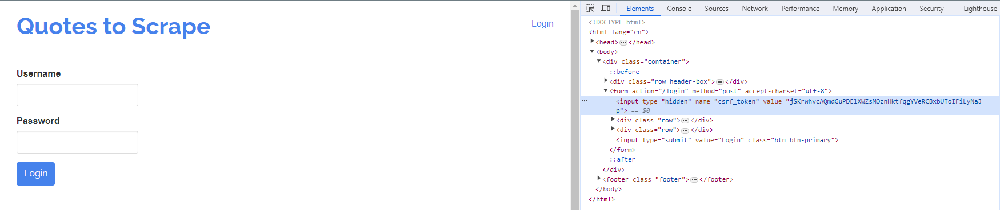

Следовательно, мы можем обратиться к данному эндпоинту, собрать поле с именем `csrf_token`, после чего сделать уже
не `GET-запрос`,
а `POST-запрос` на этот же эндпоинт с таким пэйлоудом:

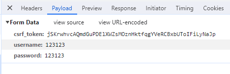

Однако, нам нужно будет заменить поля `csrf_token`, `username`, `password` на свои.

#### Пример работы


#### Пример выходного файла

Выходной файл можно посмотреть здесь: [BasicParserOutput.xlsx](Github/OutputFiles/BasicParserOutput.xlsx)

#### Реализация

Реализацию данного типа парсера вы можете найти в файле [Helpers/AuthManager.py](Helpers/AuthManager.py)

### ViewStateParser

#### Краткое описание от toscrape.com

Форма фильтрации на основе AJAX с использованием ViewStates

#### Полное описание

Данный тип парсера предполагает сбор таких данных как:

- [X] Текст каждой из цитат
- [X] Имя автора каждой из цитат
- [ ] Дату рождения автора каждой из цитат
- [ ] Место рождения автора каждой из цитат
- [ ] Описание автора каждой из цитат
- [X] Все теги каждой из цитат

_Собираются не все данные, т.к. данное ответвление на toscrape.com не предоставляет соответствующие данные, как например
в парсер, типа BasisParser._

Данный тип парсера предполагает сбор динамически изменяемых данных (полей).

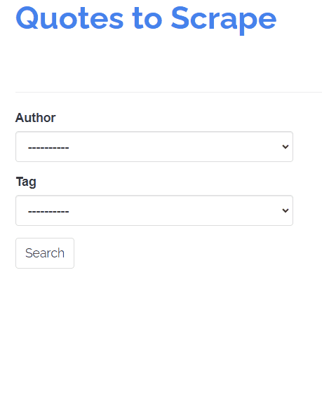

#### Вид формы

Структура формы для отправки запроса выглядит следующим образом:
1. Элемент `select` для выбора автора
```html
<select class="form-control" name="author" id="author" onchange="__doPostBack()">
    <option>----------</option>
    
    <option value="Albert Einstein" selected="">
        Albert Einstein
    </option>
    
    <option value="J.K. Rowling">
        J.K. Rowling
    </option>
    
    <option value="Jane Austen">
        Jane Austen
    </option>
    
    ...
    
    <option value="Harper Lee">
        Harper Lee
    </option>
    
    <option value="Madeleine L'Engle">
        Madeleine L'Engle
    </option>
    
</select>
```
2. Элемент `select` для выбора тега
```html
<select class="form-control" name="tag" id="tag">
    <option>----------</option>
    
    <option value="change">
        change
    </option>
    
    <option value="deep-thoughts">
        deep-thoughts
    </option>
    
    <option value="thinking" selected="">
        thinking
    </option>
    
    <option value="world">
        world
    </option>
    
    ...
    
    <option value="simile">
        simile
    </option>
    
    <option value="music">
        music
    </option>
    
    <option value="mistakes">
        mistakes
    </option>
    
</select>
```
3. Скрытое поле `__VIEWSTATE` с динамическим ключом
```html
<input type="hidden" name="__VIEWSTATE" id="__VIEWSTATE" value="ZjcyMzQ5YWVmODcyNDcwYzg1M2I0YzNjODA2ZTllZjYsQWxiZXJ0IEVpbnN0ZWluLEouSy4gUm93bGluZyxKYW5lIEF1c3RlbixNYXJpbHluIE1vbnJvZSxBbmRyw6kgR2lkZSxUaG9tYXMgQS4gRWRpc29uLEVsZWFub3IgUm9vc2V2ZWx0LFN0ZXZlIE1hcnRpbixCb2IgTWFybGV5LERyLiBTZXVzcyxEb3VnbGFzIEFkYW1zLEVsaWUgV2llc2VsLEZyaWVkcmljaCBOaWV0enNjaGUsTWFyayBUd2FpbixBbGxlbiBTYXVuZGVycyxQYWJsbyBOZXJ1ZGEsUmFscGggV2FsZG8gRW1lcnNvbixNb3RoZXIgVGVyZXNhLEdhcnJpc29uIEtlaWxsb3IsSmltIEhlbnNvbixDaGFybGVzIE0uIFNjaHVseixXaWxsaWFtIE5pY2hvbHNvbixKb3JnZSBMdWlzIEJvcmdlcyxHZW9yZ2UgRWxpb3QsR2VvcmdlIFIuUi4gTWFydGluLEMuUy4gTGV3aXMsTWFydGluIEx1dGhlciBLaW5nIEpyLixKYW1lcyBCYWxkd2luLEhhcnVraSBNdXJha2FtaSxBbGV4YW5kcmUgRHVtYXMgZmlscyxTdGVwaGVuaWUgTWV5ZXIsRXJuZXN0IEhlbWluZ3dheSxIZWxlbiBLZWxsZXIsR2VvcmdlIEJlcm5hcmQgU2hhdyxDaGFybGVzIEJ1a293c2tpLFN1emFubmUgQ29sbGlucyxKLlIuUi4gVG9sa2llbixBbGZyZWQgVGVubnlzb24sVGVycnkgUHJhdGNoZXR0LEouRC4gU2FsaW5nZXIsR2VvcmdlIENhcmxpbixKb2huIExlbm5vbixXLkMuIEZpZWxkcyxKaW1pIEhlbmRyaXgsSi5NLiBCYXJyaWUsRS5FLiBDdW1taW5ncyxLaGFsZWQgSG9zc2VpbmksSGFycGVyIExlZSxNYWRlbGVpbmUgTCdFbmdsZSwtLS0tLS0tLS0tLHRoaW5raW5n">
```

#### Пример работы


#### Пример выходного файла

Выходной файл можно посмотреть здесь: [ViewStateOutput.xlsx](Github/OutputFiles/ViewStateOutput.xlsx)

#### Реализация

Реализацию данного типа парсера вы можете найти в файле [ViewStateParser.py](Crawlers/ViewStateParser.py)

### RandomQuoteParser

#### Краткое описание от toscrape.com

Одна случайная цитата

#### Полное описание

Данный тип парсера предполагает сбор таких данных как:

- [X] Текст каждой из цитат
- [X] Имя автора каждой из цитат
- [X] Дату рождения автора каждой из цитат
- [X] Место рождения автора каждой из цитат
- [X] Описание автора каждой из цитат
- [X] Все теги каждой из цитат

Данный тип парсера является самым легким, т.к. он сконструирован по подобию BasicParser.

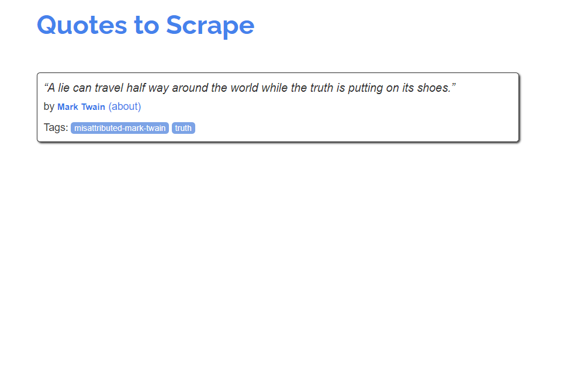

#### Пример работы


#### Пример выходного файла

Выходной файл можно посмотреть здесь: [RandomQuoteOutput.xlsx](Github/OutputFiles/RandomQuoteOutput.xlsx)

#### Реализация

Реализацию данного типа парсера вы можете найти в файле [RandomQuoteParser.py](Crawlers/RandomQuoteParser.py)

## Вклад

Если вы хотите внести свой вклад в проект, вы можете сделать следующее:

- Создайте Fork репозитория
- Внесите необходимые изменения
- Создайте Pull Request для рассмотрения

Мы будем рады принять ваши предложения и улучшения. :)

## Лицензия

Этот проект стоит под лицензией MIT. Подробности можно узнать в файле [LICENSE](LICENSE).